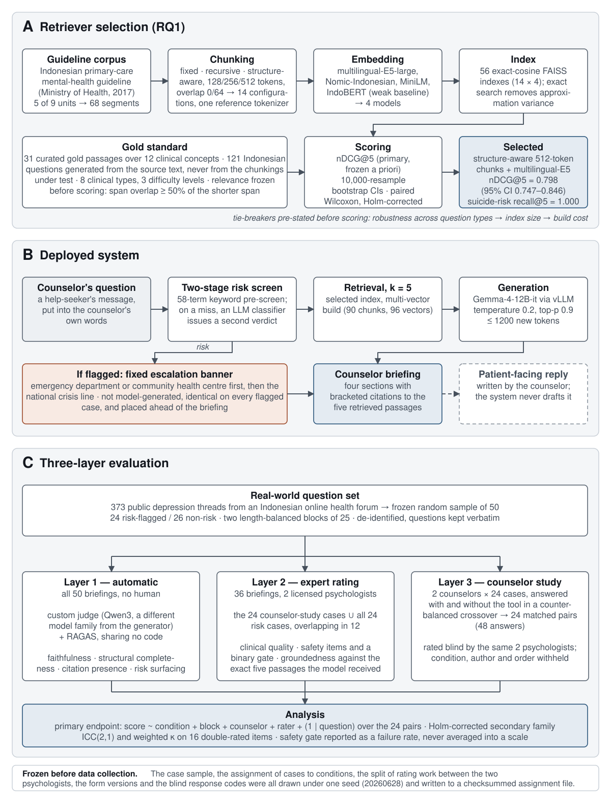
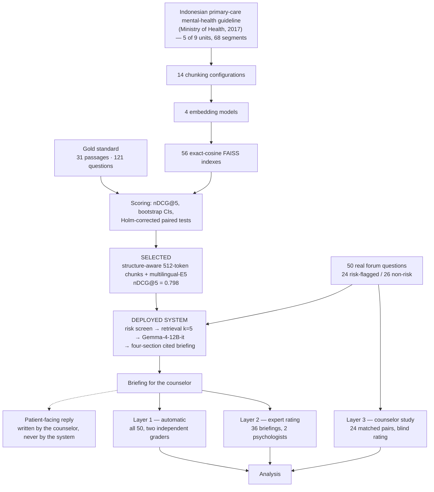

# Methodology — the pipeline from guideline PDF to expert study

*The method of this project in one document, written to sit alongside Figure 1.
Section 8 records where every number in the figure comes from, so the figure can
be re-verified rather than trusted. Companion documents: `THESIS_CONTEXT_PACK.md`
(the full factual record, including results and limitations) and
`ARCHITECTURE.md` (which script writes which file).*

---

## 1. Figure 1



**Source:** `documents/figures/methodology_figure.svg`, generated by
`scripts/build_methodology_figure.py`. Vector, 180 × 236 mm, sized for a
full-page journal figure. See section 9 for export commands.

### Caption, journal version

> **Figure 1. Study methodology.** **(A)** Retriever selection. The Indonesian
> Ministry of Health primary-care mental-health guideline was extracted, cleaned
> and segmented into a single character-offset coordinate system, then chunked
> under 14 configurations spanning three strategies and encoded by four
> embedding models, giving 56 exact-cosine indexes. These were scored on a
> purpose-built gold standard of 121 Indonesian questions over 31 curated
> passages, under a relevance rule and a primary metric fixed in configuration
> before any index was scored. **(B)** The deployed system. Every input passes a
> two-stage risk screen; a flagged input receives a fixed, non-generated
> escalation banner ahead of the briefing. The system returns a four-section
> briefing with bracketed citations to the five retrieved passages and never
> drafts the reply sent to the help-seeker. **(C)** Three-layer evaluation on a
> frozen sample of 50 real forum questions: automatic scoring of all briefings by
> two independent graders, direct expert rating of 36 briefings by two licensed
> psychologists, and a counterbalanced crossover in which two counselors answered
> 24 cases with and without the tool, rated blind by the same two psychologists.
> nDCG: normalized discounted cumulative gain; RAGAS: Retrieval Augmented
> Generation Assessment; ICC: intraclass correlation coefficient.

### Caption, short version for slides or a thesis figure list

> **Figure 1.** Study methodology: retriever selection from 56 indexes against a
> 121-question gold standard (A), the deployed counselor-facing system with its
> escalation-first safety layer (B), and the three-layer evaluation on 50 real
> forum questions (C).

### Quick-view diagram

Renders on GitHub and in any Mermaid viewer. Use this while drafting; use the
SVG for anything that goes to a supervisor or a journal.



---

## 2. Design overview

The work runs in three parts, in order, and each part's output is the next
part's input.

| part | question | unit of analysis | output |
|---|---|---|---|
| A. Retriever selection | which chunking and embedding combination retrieves the guideline best? | question (n = 121) | one selected configuration |
| B. Deployed system | — (construction, not measurement) | — | the counselor-briefing chatbot |
| C. Evaluation | is the briefing grounded, complete and safe, and does the tool help a counselor? | briefing (n = 50, n = 36); matched pair (n = 24) | the three-layer result set |

Everything in part C that could be influenced by knowing an outcome was drawn in
advance. The case sample, the assignment of cases to conditions, the split of
rating work between the two psychologists, which packets carried the long form,
and the blind response codes were generated under one seed (20260628) and
written to an assignment file that records its inputs' SHA-256 checksums and the
date of the draw. The generating script refuses to overwrite an existing draw
without an explicit override.

**What the design cannot do.** With two counselors, counselor is a fixed factor
and between-counselor variance cannot be estimated. Part C supports statements
about these two counselors on these 24 questions. It does not support a general
claim that the tool improves counselor answers. This is stated in the methods
rather than deferred to the limitations, because it determines how every number
from that arm must be read.

---

## 3. Part A — retriever selection

### 3.1 Corpus preparation

The knowledge base is the Ministry of Health primary-care mental-health
guideline for general practitioners (2017). Five of its nine core units are
indexed: early detection, the psychiatric interview, depression diagnosis and
management, psychiatric emergencies, and referral. Indexing the depression unit
alone was rejected, because the highest-stakes questions a counselor faces
(suicide risk, referral) are answered in units outside it.

Text is extracted with PyMuPDF in reading order, then cleaned: printed page
numbers dropped, private-use bullet glyphs from the Symbol and Wingdings
encodings mapped to one marker, hyphenated line breaks rejoined. The glyph map
preserves clinically meaningful characters, and de-hyphenation keeps the hyphen
so Indonesian reduplication survives. Segmentation retains only the clinical
body of each unit, delimited by the guideline's own section anchors, which
discards teaching scaffolding and reference lists. Result: 68 labelled segments
over 128,185 characters.

**The coordinate system is the load-bearing design decision.** Every segment,
chunk and gold passage carries character offsets into one cleaned text, and the
pipeline asserts at run time and in tests that a stored span equals the text it
points at. Chunking strategies cut the guideline in different places, so
relevance has to be defined over source spans and mapped onto each strategy
identically. Without this, the 56 configurations would not be comparable.

Segments also carry a content-type label (diagnostic criteria, dosage block,
referral list, case vignette) assigned by keyword rules. Contested labels went to
two independent blind LLM judges, and their adjudicated corrections live in an
override file the pipeline treats as a required input.

### 3.2 What is compared

Three chunking families, all measured with one reference tokenizer so a stated
size means the same text everywhere:

| family | behaviour | configurations |
|---|---|---|
| fixed | token sliding window (naive baseline) | {128, 256, 512} × overlap {0, 64} |
| recursive | paragraph → line → sentence → word, then packing | {128, 256, 512} × {0, 64} |
| structure-aware | one chunk per document section; never splits a tightly coupled clinical unit; oversize non-atomic sections fall back to recursive | 512-0, plus a context-enriched ablation |

Four embedding models span the plausible design space: multilingual-E5-large,
an Indonesian-adapted Nomic model, a multilingual MiniLM sentence encoder, and
mean-pooled IndoBERT as a deliberate weak baseline, included so the primary
metric can be seen to discriminate. Asymmetric query and passage prefixes are
applied where the model card specifies them, asserted by a unit test.

14 × 4 = 56 indexes, each exact cosine (FAISS inner product over L2-normalised
vectors). Exact search rather than an approximate index, because the corpus is
small and approximate search would add variance to a comparison whose
differences are of the order of hundredths.

After the selection was taken, a fifth model (BGE-M3) was added as a second
strong multilingual retriever, so the outcome could not be dismissed as
best-of-a-weak-field. It is scored and reported alongside, and the configuration
file records which models were present when the selection was made, so a claim
about the selection is always evaluated on the grid the selection came from.

### 3.3 Gold standard and relevance

121 Indonesian questions over 31 curated gold passages covering 12 clinical
concepts. Questions were generated by an LLM from the source text under a
clinically constrained prompt, never from any chunking under test, so no
strategy is favoured by construction. Each carries one of 8 clinical types
(including suicide risk and emergency) and a difficulty tag (97 factoid, 15
multi-hop, 9 applied-case). All were schema-validated, checked for near
duplicates, and reviewed question by question against the passage cited.

The set was originally 124 questions over 32 passages. One passage was withdrawn
during review because it was a master chart whose two-column layout the extractor
had flattened, placing a psychosis row under a depression heading; its three
questions went with it.

**Relevance rule, frozen before any index was scored.** A retrieved chunk is
relevant to a question if, for any gold passage that question cites, the overlap
between the two character spans reaches 50% of the shorter of the two.
Normalising by the shorter span keeps the rule usable across gold passages
ranging from roughly 330 to 24,800 characters: a short passage inside a long
chunk and a short chunk inside a long passage both score 1.0, whereas
normalising by the gold span would make the longest passages unsatisfiable by
any single chunk. A sensitivity analysis re-scored every index under the
answer-containment alternative.

### 3.4 Metrics, statistics and the tie-break

Recall, precision, MRR and nDCG per query at k ∈ {1, 3, 5, 10}, plus a multi-hop
coverage measure. **Recall@k here is a hit indicator** (does any relevant chunk
appear in the top k), the usual convention for single-gold-passage sets but not
the ratio of retrieved to relevant; it is defined explicitly for that reason.

nDCG@5 was fixed as the primary metric in configuration before scoring. This was
an implementation-time freeze, not a public pre-registration, and is reported as
such. The cutoff matches deployment: the generator reads five chunks, so the
graded quality of that window is what matters, whereas rank-1 metrics reward a
behaviour (near-duplicate top hits from small overlapping chunks) that is
irrelevant when a model reads all five.

Uncertainty: percentile bootstrap over the 121 questions, 10,000 resamples. The
leading configuration is compared with its nearest challengers by paired
bootstrap on per-query differences and by Wilcoxon signed-rank tests, with Holm
correction across the family and rank-biserial effect sizes.

Because configurations at the top were expected to tie, tie-breakers were stated
before scoring: robustness across question types first, with weight on the
suicide-risk and emergency type and on the worst per-type floor; then index size
and latency; then build cost. The selection is recorded in a machine-readable
file that a checking script re-derives from the scored tables, exiting non-zero
if the recorded selection no longer follows.

Three sensitivity analyses ran after selection: the alternative relevance rule,
an alternative reference tokenizer, and a probe that rebuilt every model's index
in multi-vector form to test how much of the between-model gap is
context-window truncation rather than model quality.

---

## 4. Part B — the deployed system

### 4.1 What the counselor receives

Four labelled sections: relevant guideline content with bracketed citations,
clinical considerations for this case, danger signs to check, and referral
options. Bracketed markers contain digits only and resolve to the five retrieved
passages, displayed beneath the briefing. A closing sentence states that the
material is decision support and the clinical decision remains with the
counselor. The system does not write the reply to the help-seeker, and the
prompt forbids it explicitly, including any closing block of advice addressed to
the person who asked.

Two further prompt rules exist because corpus and reader are mismatched. The
guideline is written for physicians while the reader is a counselor who does not
diagnose, examine or prescribe, so a physician-only act must be written as
something to refer. And any mention of suicide or self-harm risk, even as
something merely to check, must name the escalation route in the same passage,
written without a citation marker because it is a standing emergency
instruction rather than a quotation.

All prompts are Indonesian, which keeps the instrument readable by the
counselors and psychologists whose judgement the study depends on.

### 4.2 Retrieval and generation

The deployed retriever is the selected configuration in a multi-vector build, in
which a chunk longer than the encoder window is embedded as several windows that
map back to one chunk and are deduplicated at search time: 90 chunks in 96
vectors. Depth is k = 5, following the planning specification; on the gold set
that depth leaves 6 of 121 questions without a relevant chunk, none of them
safety-critical, while k = 10 would recover 5 of the 6 at roughly double the
prompt context.

Generation uses the instruction-tuned Gemma-4-12B served by vLLM at bfloat16,
temperature 0.2, top-p 0.9, and a 1200-token cap that replaced an earlier
700-token cap which truncated briefings mid-section. A briefing takes roughly 20
to 60 seconds on one A40 GPU. The instruction-tuned variant is required, since
the base model does not follow system prompts; this is a change from the planned
Gemma-3-12B and is recorded as a protocol update.

### 4.3 The safety layer

Two stages, answered escalation-first.

1. **Keyword pre-screen** on every input: 58 Indonesian and English risk
   expressions, matched after folding case, punctuation and spacing, with a
   second pass over the de-spaced string so run-together typing is still caught.
   The list covers explicit suicide phrasing, wishes to die or disappear,
   self-harm vocabulary and named means. It is deliberately over-inclusive: a hit
   only raises a banner and adds a risk instruction, so a false positive costs a
   redundant warning while a miss costs the warning altogether. It will fire on a
   counselor's purely informational question, and that is accepted.
2. **LLM classifier**, run only when the keywords do not fire.

A flagged input produces a fixed, non-generated banner *before* the briefing,
directing first to emergency care and then to the national crisis line. Emergency
care is first because that line is psychological first aid with capped session
length rather than emergency response, and acute risk needs in-person
assessment. Two details are deliberately absent: the general emergency dispatch
number, since the template routes to facilities that can perform a psychiatric
assessment, and any statement of operating hours, since government sources
disagree and the service states none.

**The ordering is the point.** Deterministic escalation content leads and model
output follows, so a generation failure can degrade the briefing without touching
the escalation. Every interaction is logged with the retrieved chunks, the safety
verdict and the prompt.

The system prompt was revised on 1 August 2026, before any human data
collection. The previous version allowed the model to raise suicide risk without
naming an escalation route, which it did in 34 of 50 briefings. All 50 study
briefings were regenerated under the revised prompt, with the risk verdicts
pinned from the pre-revision run so that resampling the classifier could not
silently re-randomise the frozen stratification. After the revision, 46 briefings
mention risk and all 46 give a route.

---

## 5. Part C — three-layer evaluation

### 5.1 The question set

373 public depression threads from an Indonesian online health forum (375
scraped, 2 duplicates removed). From these, a frozen sample of 50 drawn under the
project seed, assigned to two blocks of 25 balanced on question length as a
difficulty proxy. The deployed safety screen flags 24 of the 50, and the
stratification places exactly 12 in each block.

These are real questions with no validated reference answers. The physician reply
attached to each thread is retained for reference only and is never a gold
standard. Before use, three self-introduced names were replaced and every source
URL reduced to a hash held separately. Question text is kept verbatim, because
paraphrasing would alter the stimuli the study measures; the protection this
offers is against casual rather than determined re-identification, and it is why
the question data is excluded from the public code release.

### 5.2 Layer 1 — automatic

Answer-similarity scoring against the forum physician's reply is invalid here and
is not used: the briefing is a decision-support document for a professional and
the forum reply is a patient-facing answer, so the two differ in genre before
they differ in quality. An earlier coverage metric against the physician's reply
was dropped for the same reason. The consequence is stated plainly: this layer
certifies grounding, structure and safety, and says nothing about clinical
usefulness.

Two independent graders score all 50 briefings.

- A **custom judge** measures faithfulness (the share of distinct clinical claims
  the retrieved passages support), structural completeness, citation presence,
  and, on risk-flagged questions only, whether the danger-signs section surfaces
  the risk and directs to emergency care or referral. The judge is a Qwen3 model
  at temperature 0, from a different model family than the generator to avoid
  self-preference, and validated before use on two constructed briefings with
  known properties; it had to separate them on every metric before any study
  output was scored. The run was repeated at a second judge size.
- **RAGAS** supplies reference-free faithfulness, answer relevancy and context
  precision under an independent implementation and prompt set, giving a second
  view of grounding that shares no code with the custom judge.

Judge stability is measured rather than assumed. Three cases re-scored four times
at two concurrency settings moved by up to 0.281 on faithfulness at identical
settings, which locates the variation in judge sampling rather than concurrency.
Single-run means are therefore reported as indicative, with a range wherever a
number carries weight.

### 5.3 Layer 2 — direct expert rating of the tool (36 briefings)

The sample is the union of the 24 counselor-study cases and all 24 risk-flagged
cases, which overlap in 12, so 24 + 24 − 12 = 36. **The count is derived, not
chosen.** Two constraints produce it: every counselor-study case is rated so
briefing quality and workflow benefit can be compared case by case, and every
risk case is rated so the safety estimate uses all 24; on 12 risk cases a single
observed failure would carry an interval too wide to support any safety
statement.

Raters see the briefing together with the exact five passages the generator
received, taken from the stored generation record rather than re-retrieved. The
instrument takes clinical-quality items from an established clinician rubric,
retains a published safety block verbatim so it stays comparable with the
counselor-answer instrument, adds a binary critical-safety gate, and adds a
faithfulness section covering groundedness, context sufficiency (which separates
retrieval failure from generation failure) and a flag for unsourced clinical
claims. A holistic item closes the form.

To fit expert time, the faithfulness section is completed for a stratified half
of each rater's packets, 11 of 22, drawn under the project seed. Because the 8
double-rated cases all take the full form, this is **14 of the 36 distinct cases**
(22 full-form ratings in total), not 18. The skip is printed on the form so raters
never choose what to omit; self-selected skipping would correlate with difficulty
and fatigue.

> The design document states 18 of 36 for this sub-sample. The frozen assignment
> file, which is what actually generated the workbooks, records 14 full-form cases
> and 11 full-form packets per rater. Quote the frozen file: it governs the study.
> See section 8.

Raters also record their own independent judgement of whether each *question*
shows danger signs, before rating anything else and without being told what the
system decided. This is the only expert reference the study produces for the
screen that gates the safety layer.

### 5.4 Layer 3 — counselor study (24 matched pairs)

Two counselors each answer 24 questions, a stratified random sample of 6 risk and
6 non-risk cases per block, drawn under the project seed and frozen before any
answering. Counselor 1 uses the tool on the block-1 cases and answers block 2
unaided; counselor 2 mirrors this. Every sampled case therefore receives exactly
one with-tool and one without-tool answer: 24 matched pairs, 48 answers, with
order and question difficulty balanced by construction. Resource parity is
enforced, with no web search or other AI in either condition, so the briefing is
the only manipulated input.

**Counselors put each case in their own words rather than pasting the forum
text.** This is not procedural tidiness. Dense retrieval follows the register of
the query: a pasted narrative fills four of five retrieval slots with generic
exposition and returns no referral passage, whereas a clinical question returns
none as generic and two to four risk or referral passages. The counselor's
framing is part of the treatment being evaluated, and because the comparison is
paired within question and within counselor, the added phrasing variance sits
inside the treatment rather than in the outcome. Phrasing was not coached:
coaching would measure the tool in expert hands and would prime the very safety
screen under evaluation.

Rating work is split between the two psychologists by **whole case bundle**. A
counselor-study case carries both its answers and its briefing packet; a
risk-only case carries its packet. Bundles are never divided, so both arms of
every within-case comparison stay with one rater, rater strictness cancels inside
the comparison, and rater cannot be confounded with condition. Eight cases (16
items, about 19% of the load) are rated by both for agreement. Each rater
receives 50 items in one seeded sequence interleaving briefings and counselor
answers, rather than all of one kind first, because a strict two-stage order
would confound rater drift with the difference between the two materials.

Counselors additionally rate each with-tool case on perceived helpfulness, help
in recognising danger signs, whether the briefing changed their answer, and
confidence. Confidence is collected in **both** conditions, so the difference
reads as an automation-bias probe rather than as satisfaction.

### 5.5 Blinding

Counselor answers reach the raters as random response codes drawn from the frozen
crossover, so the codes exist before the answers do; condition, counselor
identity and order are withheld and the key is sealed until analysis. Briefing
rating is unblinded by nature, since a cited machine-written briefing is
recognisable, which is acceptable because that arm has no comparison condition
and is an absolute measurement. The residual risk of interleaving is that a rater
who has seen briefings may recognise their style inside a with-tool answer;
judged small because counselors rewrite substantially into patient-facing prose,
with the strict two-stage order retained as a documented fallback.

The fixed safety banner is not printed in the rated material, because including
it would announce the classifier's verdict on exactly the 24 cases where the
rater's independent risk judgement carries information. Safety items are
therefore reported split by risk status, and within the risk stratum they measure
model-generated safety content only.

### 5.6 Analysis

The primary endpoint is the blinded psychologist rating of counselor answers,
over the 24 matched pairs, with a mixed model `score ~ condition + block +
counselor + rater + (1 | question)`. Rater enters as a fixed effect because it
has two levels, and it cannot confound condition because bundles keep both
answers of a pair with one rater. A first-block sensitivity analysis repeats the
comparison on the carryover-free half.

Secondary analyses are pre-specified and Holm-corrected as one family: briefing
quality, safety and holistic ratings with bootstrap intervals, reported
separately for risk and non-risk cases and never pooled, since the briefing set
is 24 risk and 12 non-risk by construction; agreement on the shared items using
ICC(2,1) and weighted κ; calibration of automatic faithfulness against human
groundedness on the same cases; and the counselor self-report items. Analyses the
design cannot support are named exploratory and excluded from the correction
family.

The binary safety gate is reported as a failure rate by condition and by risk
status, never averaged into a scale score, since a mean of a safety gate has no
interpretation. Validation of the risk screen against the raters' independent
judgements reports the two error directions separately, and prints agreement
between the two raters before any statement about the screen, on the grounds that
a reference standard the raters cannot reproduce between themselves cannot
validate anything.

**Power.** With 24 pairs, a paired test at α = .05 has 80% power for dz ≈ 0.6.
This is a feasibility evaluation powered for large effects; a null result is
inconclusive rather than evidence of no effect.

**Aliasing.** Condition is aliased with counselor by block: counselor 1 uses the
tool only on block-1 cases and counselor 2 only on block-2 cases, so a condition
effect and a counselor-by-block interaction cannot be separated. The crossover
buys within-question control, which matters most in real forum data where
between-case difficulty dominates, and pays for it in this aliasing. Block enters
the model to absorb the estimable part, and the first-block sensitivity analysis
checks the comparison on the half that carries no carryover.

---

## 6. Reproducibility controls

| control | detail |
|---|---|
| seed | 20260628 for every run, every bootstrap and every study draw; new draws must consume the shared generator in a fixed order so appending cannot disturb an earlier draw |
| manifests | every pipeline run writes package versions, configuration, seed, input and output SHA-256 checksums, and resolved model revisions |
| index metadata | each index pins its checkpoint revision, token statistics, truncation rate and build time |
| exact search | FAISS inner product on normalised vectors; no approximate-search variance |
| tests | 163 tests covering the character-offset invariant, the chunkers, embedding prefixes, metrics, bootstrap, determinism, the chatbot's pure functions, de-identification and the study draws |
| frozen artifacts | the 50-question sample, the generated briefings whose risk flags define the strata, and the assignment file; the freezing script refuses to overwrite without an override, and the previous freeze is retained |
| selection check | a script re-derives the recorded selection from the scored tables and exits non-zero if it no longer follows |

---

## 7. Method changes made during the project

Recorded here because a methods section should disclose them rather than present
the final state as the original plan.

| date | change | why |
|---|---|---|
| 2026-07-12 | BGE-M3 added as a post-selection challenger | so the outcome is not best-of-a-weak-field; scored and reported separately from the selection grid |
| 2026-07-21 | per-case scoring keys dropped | drafted but not clinically validated; correctness and completeness now rest on expert judgement, disclosed as a limitation |
| 2026-07-26 | one gold passage and its 3 questions withdrawn | a two-column table the extractor had flattened |
| 2026-07-27 | coverage against the physician reply dropped | genre mismatch between a counselor briefing and a patient-facing answer |
| 2026-08-01 | system prompt revised, all 50 briefings regenerated | the prior prompt allowed risk to be raised without an escalation route in 34 of 50 briefings; risk verdicts pinned so the frozen stratification could not shift |
| 2026-08-06 | keyword screen expanded; safety-gate item given a not-applicable option | the original 15 formal phrases matched none of 16 colloquial probes; the binary gate forced "safe" to mean both *handled well* and *nothing to handle* |
| 2026-08-17 | citation-correctness item removed; scope item restructured | the item fed no analysis, so nothing now checks the bracketed markers, which is disclosed; the scope item had been asking two questions on one scale |
| — | generator changed from Gemma-3-12B to Gemma-4-12B-it | the base model does not follow system prompts |

---

## 8. Provenance of every number in Figure 1

Re-verify these before submission. Commands assume the project root.

| figure text | value | source |
|---|---|---|
| 5 of 9 units | scope list | `configs/pipeline.yaml → source.scope` |
| 68 segments | 68 | `wc -l data/derived/segments.jsonl` |
| 128,185 characters | 128185 | `wc -c data/derived/cleaned_text.txt` |
| 14 configurations | 14 | `ls outputs/chunks/*.jsonl \| wc -l` |
| 4 models, 56 indexes | 14 × 4 | `configs/embedding_models.yaml → index.models` |
| 31 gold passages | 31 | `wc -l data/derived/gold_passages.jsonl` |
| 121 questions | 121 | `wc -l data/derived/questions_gold.jsonl` |
| span overlap ≥ 50% of the shorter span | `denom: shorter`, `min_overlap_frac: 0.5` | `configs/relevance.yaml` |
| nDCG@5 primary | `primary_metric: ndcg@5` | `configs/relevance.yaml` |
| nDCG@5 = 0.798 (95% CI 0.747–0.846) | 0.7980 [0.7466, 0.8461] | `outputs/analysis/selection.json` |
| suicide-risk recall@5 = 1.000 | 1.0 | `selection.json → tie_breaker` |
| 58 keyword terms | 58 | `configs/chatbot.yaml → safety.keywords` |
| k = 5 | 5 | `configs/chatbot.yaml → retriever.k` |
| 90 chunks, 96 vectors | 90 / 96 | `outputs/indexes/structure-512-0__e5-large__mv/meta.json` |
| temperature 0.2, top-p 0.9, ≤ 1200 tokens | as stated | `configs/chatbot.yaml → generator` |
| 373 threads | 373 | `wc -l data/derived/questions_alodokter.jsonl` |
| 50 sampled, 24 risk / 26 non-risk | 50, 24/26 | `outputs/analysis/study_answers_chatbot.jsonl` (`risky` field) |
| 36 briefings, 14 on the full form | `p1_union: 36`, `p1_full_form: 14`, 11 per rater | `data/derived/eval_case_assignments.json → counts` |
| 24 matched pairs, 48 answers | 48 rows | `wc -l data/derived/counselor_answers.jsonl` |
| 16 double-rated items | 8 shared cases × 2 | `eval_case_assignments.json` |
| seed 20260628 | 20260628 | `configs/pipeline.yaml → run.seed` |

---

## 9. Regenerating and exporting the figure

```bash
# rebuild the SVG after editing scripts/build_methodology_figure.py
./.venv/bin/python scripts/build_methodology_figure.py

# 600 dpi PNG (most journals accept this for line art; JMIR does)
convert -density 600 -background white \
        documents/figures/methodology_figure.svg \
        documents/figures/methodology_figure.png

# if a journal demands EPS or PDF vector, convert with Inkscape locally
inkscape documents/figures/methodology_figure.svg \
         --export-type=pdf --export-filename=methodology_figure.pdf
```

**Design constraints the script enforces**, all of them ordinary submission
requirements rather than preferences:

- vector output at 180 mm width, the standard double-column measure;
- smallest type 7 pt at final printed size, which is the usual floor;
- one accent family only (the safety path), everything else neutral, so the
  figure survives greyscale printing and the common forms of colour blindness;
- meaning carried by position and label, never by hue alone;
- panel letters A, B, C, so the caption can address panels directly.

To edit by hand rather than by script, open the SVG in Inkscape or Illustrator.
Every box is a plain `<rect>` with `<text>` siblings, so text is editable and
selectable rather than outlined.

---

## 10. Where to read further

| topic | document |
|---|---|
| the complete factual record, with results, status and limitations | `THESIS_CONTEXT_PACK.md` |
| which script writes which file, and the run order | `ARCHITECTURE.md` |
| the human-evaluation design in full, with instrument rationale | `evaluation/evaluation_design_v2.md` |
| the protocol amendment of 6 August 2026 | `evaluation/protocol_amendment_20260806.md` |
| the safety layer, its provenance and its honest limit | `safety_layer.md` |
| the prompt revision and the regeneration it forced | `prompt_fix_20260801.md` |
| why counselors paraphrase, with the retrieval measurement behind it | `query_phrasing_probe.md` |
| the manuscript methods section written from all of this | `jmir_latex/main.tex` |
