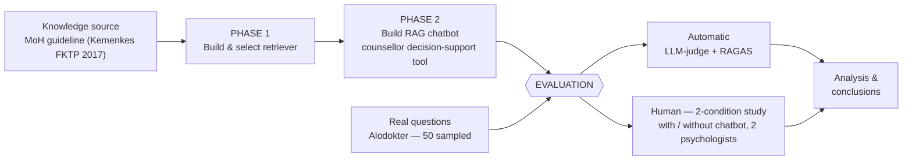
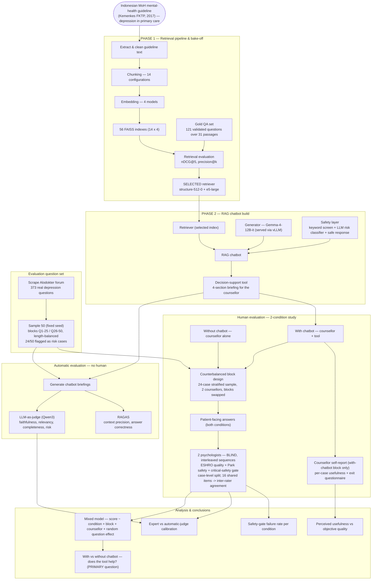

# Methodology flowchart — depression RAG chatbot, source → evaluation

Two diagrams: a **one-glance overview** to open the explanation, then a **detailed
stage-by-stage** flow. Speaker-notes at the bottom give one line to say per box.

Render anywhere Mermaid is supported: paste into <https://mermaid.live>, GitHub, or VS Code
(“Markdown Preview Mermaid Support”). Ask if you want this exported as an image/slide.

---

## A. One-glance overview (use this first)

**The story in one breath:** a fixed knowledge source → a retriever we tuned and picked
(Phase 1) → a chatbot built on it as a counsellor decision-support tool (Phase 2) → tested on
real questions, first cheaply by machine, then definitively by humans → analysis.

---

## B. Detailed stage-by-stage flow

---

## C. Speaker-notes (one line per stage)

1. **Knowledge source.** Everything is grounded in one authoritative document — the Indonesian
   MoH primary-care mental-health guideline — so the chatbot can only speak from validated content.
2. **Phase 1 — retriever.** Before any chatbot, we found the best way to *retrieve* the right
   guideline passage: we built 56 index variants (chunking × embedding), scored them on a
   validated gold question set (nDCG@5), and selected the winner.
3. **Phase 2 — chatbot.** On that retriever we built a RAG chatbot with a safety layer, as a
   decision-support tool that briefs the *counsellor*.
4. **Question set.** We test on *real* questions — 373 scraped from Alodokter, a fixed 50-sample,
   half of them genuine risk cases (suicidal ideation) — not on toy inputs.
5. **Automatic evaluation.** First a cheap, fast machine pass (LLM-as-judge + RAGAS) on the
   chatbot's briefings — this screens quality but cannot judge whether the tool *helps a human*.
6. **Human evaluation.** The core study: two conditions — counsellor alone vs counsellor +
   tool — a frozen 24-case stratified sample, counterbalanced across two counsellors; all
   answers rated blind by two psychologists (case-level split, 16 shared items for
   inter-rater agreement) on a rubric (ESHRO quality + Park safety), plus the counsellor's
   own usefulness ratings in the with-chatbot block.
7. **Analysis.** The primary comparison — does the tool help (with vs without chatbot) —
   plus a safety failure rate per condition, a perception-vs-quality check, and calibration
   of the automatic judge against the expert.

> Numbers (56 indexes, 373→50, 24 risk cases, nDCG@5 value, model names) are from the project
> record; re-confirm against `outputs/analysis/` and the phase notes before quoting exact
> figures to your supervisor (per the no-hallucination rule).
